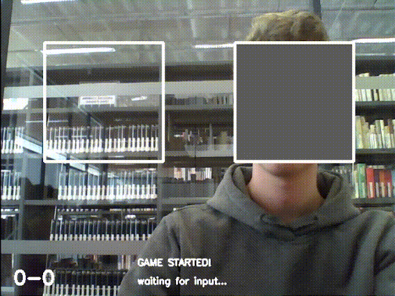

# RPS (Rock-Paper-Scissors) with AI

## Description

Play rock-paper-scissors against AI using your webcam. This Python code
utilizes a Convolutional Neural Network (CNN) implemented with Keras to
recognize hand gestures, providing an interactive experience for the game.

## Prerequisites

Before you begin, ensure you have the following dependencies installed:

- `numpy` version 1.24.3
- `opencv_python` version 4.8.1.78
- `playsound` version 1.3.0
- `tensorflow` version 2.14.0

You can easily set up these dependencies by referencing the `requirements.txt`
file.

## How to Use

Follow these steps to get started with the RPS AI game:

1. **Capture Data** (`capture_data.py`):
   - Use this script to capture images of hand gestures that the AI will later
     train on. Aim to gather around 500 images for each class (rock, paper,
     scissors, and empty).
   - To improve prediction accuracy, capture data from various angles and hand
     positions.

2. **Train the Model** (`train_model.py`):
   - Here, the CNN will learn to recognize your hand gestures. Keep in mind
     that the training process may take some time, depending on your hardware
     capabilities.
   - The trained model is saved and later loaded when playing the game.

3. **Play the Game** (`play_game.py`):
   - As the name suggests, this is where you can enjoy a round of
     rock-paper-scissors against the AI.
   - To make your move, place your hand inside the left box. The box should
     turn yellow when it detects your gesture. Holding the gesture for a
     specified duration triggers the game mechanism, and a round is played.
   - The game provides logging and audio-visual feedback. A running score is
     displayed in the bottom left corner.

## Customization

You can customize the game's frame rate, window dimensions, and more by
modifying the variables stored in `constants.py`. Adjust these variables to
fine-tune the game to your liking.

## License

This project is dedicated to the public domain under the [CC0 1.0 Universal
(CC0 1.0)](LICENSE) License.

You are free to copy, modify, distribute, and use the code in any way you see
fit. There are no restrictions, and you are not required to provide
attribution.
